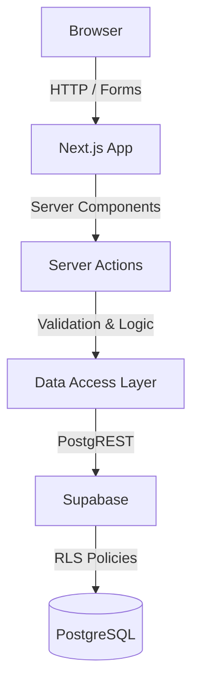

# Project Forum

Project Forum is an exclusive, academic discussion platform built to bridge the gap between students, teachers, and administrators at IIITG. Designed to solve the problem of fragmented academic discourse and lost knowledge across temporary chat applications, it provides a centralized, organized, and permanent repository where complex academic questions can be asked, answered, upvoted, and formally resolved in a secure environment.

## Project Status

**Current Version:** v1.0.0
**Status:** Actively Developed

## Core Design Principles

- **Server Components first:** Heavy reliance on Next.js Server Components to minimize client-side JavaScript.
- **Server-side authorization:** Strict backend-only validation for role and content access.
- **Row Level Security (RLS):** Database-level security to inherently protect data across all queries.
- **Production Security Hardening:** Idiomatic PostgreSQL triggers augmenting RLS for zero-trust column-level immutability.
- **Data Access Layer (DAL):** Clean, modular separation of database operations away from the UI.
- **Small, incremental feature development:** Methodical, ticket-based project progression.
- **Security before convenience:** Zero trust in client-side state; robust permissions built into the core.

## Features

### Authentication
- **Google OAuth**: Fast and secure single sign-on.
- **IIITG Email Restriction**: Platform access is strictly ring-fenced to authorized institutional email addresses.

### Forum
- **Subjects**: Content is cleanly categorized into dedicated academic subjects.
- **Questions**: Detailed academic question boards.
- **Answers**: Collaborative peer and faculty answering capabilities.
- **Solved Questions**: Authors and moderators can mark questions as definitively solved.
- **Upvotes**: Community-driven content curation via upvoting for both questions and answers.
- **Edit/Delete**: Secure content management allowing authors to modify their own work.
- **Attachments**: Native support for uploading images and PDFs (up to 10MB) directly to questions and answers, complete with custom, native full-screen viewer interfaces.
- **Global Search**: Sitewide search capabilities spanning questions and answers.
- **Feed Sorting & Pagination**: Robust options for sorting questions and handling large datasets.
- **User Profiles**: Public lightweight profiles showing questions and answers for each student.

### Moderation
- **Reporting System**: Integrated flagging and reporting of inappropriate questions and answers.
- **Content Moderation (Hide/Restore)**: Admins and teachers can hide or restore reported content.
- **User Suspension**: Administrative capabilities to suspend misbehaving students.
- **Teacher Dashboard**: Specialized views for faculty to monitor unanswered and unresolved questions.
- **Admin Dashboard**: Centralized control center for platform oversight.
- **Role Management**: Strict, server-enforced role assignments (Student, Teacher, Admin).

## Tech Stack

### Frontend
- Next.js 16 (App Router)
- React
- TypeScript
- Tailwind CSS

### Backend
- Supabase
- PostgreSQL
- Row Level Security (RLS)

### Authentication
- Google OAuth

## Architecture



## Getting Started

### Prerequisites
- Node.js 18+
- npm or yarn
- A Supabase Project
- Google Cloud Console Project (for OAuth credentials)

### Installation
Clone the repository and install dependencies:
```bash
git clone https://github.com/FN1ORM/project-forum.git
cd project-forum
npm install
```

### Environment Variables
Create a `.env.local` file in the root directory and add the following variables:
```env
NEXT_PUBLIC_SUPABASE_URL=your_supabase_project_url
NEXT_PUBLIC_SUPABASE_ANON_KEY=your_supabase_anon_key
```

### Running locally
Start the development server:
```bash
npm run dev
```
Open [http://localhost:3000](http://localhost:3000) with your browser to see the result.

## Screenshots

### Home Page
*(Add screenshot here)*

### Question Page
*(Add screenshot here)*

### Teacher Dashboard
*(Add screenshot here)*

### Admin Dashboard
*(Add screenshot here)*

## Roadmap

- [x] Authentication & Authorization
- [x] Subject & Question Board
- [x] Answer & Upvote System
- [x] Solved Badges
- [x] Edit & Delete System
- [x] Teacher & Admin Dashboards
- [x] Attachments
- [x] Global Search
- [x] Feed Sorting & Pagination
- [x] User Profiles
- [x] Reporting System & Moderation
- [x] Production Security Hardening
- [ ] Notifications
- [ ] UI Polish
- [ ] Production Deployment

## Contributing

This project is currently under active development. At this time, external contributions are not yet being accepted.

## License

This project is licensed under the MIT License.
